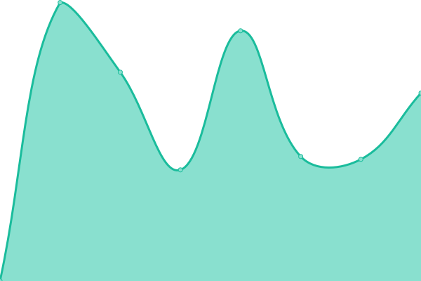
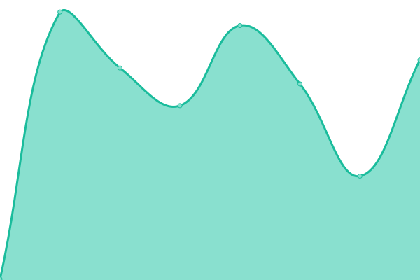

# [📈 Live Status](https://status.getlokki.com): <!--live status--> **🟩 All systems operational**

This repository contains the open-source uptime monitor and status page for [Lokki](https://status.getlokki.com), powered by [Upptime](https://github.com/upptime/upptime).

With [Upptime](https://upptime.js.org), you can get your own unlimited and free uptime monitor and status page, powered entirely by a GitHub repository. We use [Issues](https://github.com/LokkiApp/LokkiApp.github.io/issues) as incident reports, [Actions](https://github.com/LokkiApp/LokkiApp.github.io/actions) as uptime monitors, and [Pages](https://status.getlokki.com) for the status page.

<!--start: status pages-->
<!-- This summary is generated by Upptime (https://github.com/upptime/upptime) -->
<!-- Do not edit this manually, your changes will be overwritten -->
<!-- prettier-ignore -->
| URL | Status | History | Response Time | Uptime |
| --- | ------ | ------- | ------------- | ------ |
|  [Dashboard](https://app.getlokki.com) | 🟩 Up | [dashboard.yml](https://github.com/LokkiApp/LokkiApp.github.io/commits/HEAD/history/dashboard.yml) | 

 1132ms
     
 | 

<a href="https://status.getlokki.com/history/dashboard">100.00%</a>
    

|  [Api](https://api.getlokki.com/v2/api) | 🟩 Up | [api.yml](https://github.com/LokkiApp/LokkiApp.github.io/commits/HEAD/history/api.yml) | 

 642ms
     
 | 

<a href="https://status.getlokki.com/history/api">100.00%</a>
    

|  [Strapi](https://strapi.getlokki.com) | 🟩 Up | [strapi.yml](https://github.com/LokkiApp/LokkiApp.github.io/commits/HEAD/history/strapi.yml) | 

 415ms
     
 | 

<a href="https://status.getlokki.com/history/strapi">99.92%</a>
    

|  [Rental Place](https://www.lokki.rent/) | 🟩 Up | [rental-place.yml](https://github.com/LokkiApp/LokkiApp.github.io/commits/HEAD/history/rental-place.yml) | 

 509ms
     
 | 

<a href="https://status.getlokki.com/history/rental-place">100.00%</a>
    

|  [Online-Store](https://rent-itoum.lokki.rent/) | 🟩 Up | [online-store.yml](https://github.com/LokkiApp/LokkiApp.github.io/commits/HEAD/history/online-store.yml) | 

 400ms
     
 | 

<a href="https://status.getlokki.com/history/online-store">99.91%</a>
    

<!--end: status pages-->

[**Visit our status website →**](https://status.getlokki.com)

## 📄 License

- Powered by: [Upptime](https://github.com/upptime/upptime)
- Code: [MIT](./LICENSE) © [Lokki](https://status.getlokki.com)
- Data in the `./history` directory: [Open Database License](https://opendatacommons.org/licenses/odbl/1-0/)
